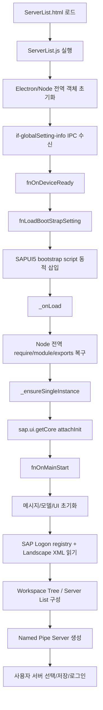
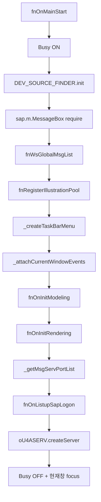
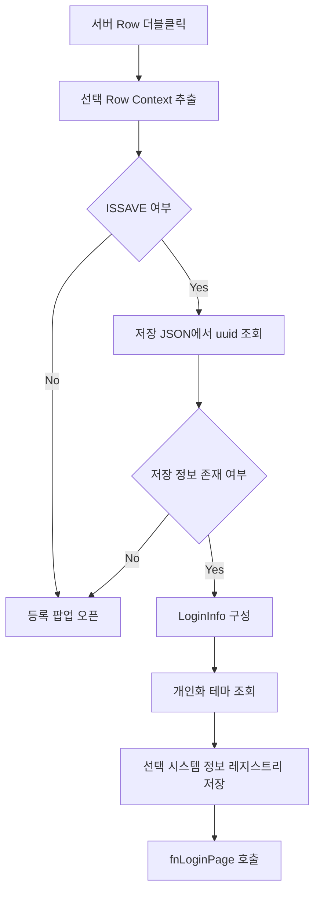

# ServerList_v2 전체 흐름 분석

## 1. 분석 대상

첨부 ZIP의 핵심 진입 파일은 `ServerList.html`과 `ServerList.js`입니다. 화면은 Electron 환경에서 실행되며, UI는 SAPUI5로 동적 생성됩니다. 사용자가 안내한 흐름처럼 시작점은 `oAPP.fn.fnLoadBootStrapSetting()`이고, UI5 bootstrap 완료 후 `data-sap-ui-oninit="_onLoad"`에 의해 `_onLoad()`로 넘어갑니다.

프로젝트 구성은 다음과 같습니다.

```text
ServerList_v2/
├─ ServerList.html
├─ ServerList.js
├─ css/
│  ├─ server.css
│  └─ serverInfo.css
└─ modules/Server/net/
   ├─ index.js
   └─ PRC_MODULES/
      ├─ CONNECT/
      ├─ DISCONNECT/
      ├─ ERROR/
      ├─ ISCONNECT/
      ├─ OPEN_SERVER/
      ├─ TEST/
      └─ WS20/
```

---

## 2. 전체 실행 흐름 요약



---

## 3. HTML 진입 구조

`ServerList.html`은 실제 UI를 거의 포함하지 않고, 아래 요소만 제공합니다.

| 요소 | 역할 |
|---|---|
| `serverInfo.css` | 서버 리스트 화면의 스타일 적용 |
| `u4aWsAudio` | SAP 메시지/오류 사운드 재생용 audio 태그 |
| `u4aWsBusyIndicator` | UI5 로딩 전부터 사용할 수 있는 Busy Indicator |
| `#content` | SAPUI5 App이 최종적으로 placeAt 되는 루트 DOM |
| `ServerList.js` | 전체 애플리케이션 로직 |

즉, 화면 전체는 HTML에 정적으로 그려지는 것이 아니라 `ServerList.js`에서 SAPUI5 Control을 생성해서 `#content`에 렌더링하는 구조입니다.

---

## 4. ServerList.js 초기화 구조

### 4.1 oAPP 전역 객체 구성

초기 IIFE에서 `window.oAPP`를 생성하고, 다음과 같은 구조를 준비합니다.

```js
oAPP.fn = {};
oAPP.data = {};
oAPP.attr = {};
oAPP.msg = {};
oAPP.data.SAPLogon = {};
oAPP.data.SAPLogon.aSys32MsgServPort = [];
```

주요 Electron/Node 객체도 이 시점에 바인딩됩니다.

| 변수 | 역할 |
|---|---|
| `oAPP.REMOTE` | `@electron/remote` 접근 |
| `oAPP.PATH` | Node path 모듈 |
| `oAPP.APP` | Electron app 객체 |
| `oAPP.IPCRENDERER` | Renderer IPC |
| `oAPP.APPPATH` | 앱 루트 경로 |
| `oAPP.DIALOG` | Electron dialog |
| `oAPP.CURRWIN` | 현재 BrowserWindow |

### 4.2 글로벌 설정 수신 후 시작

`ServerList.js`는 바로 UI를 시작하지 않고, 먼저 IPC 이벤트를 기다립니다.

```js
oAPP.IPCRENDERER.on("if-globalSetting-info", (events, oInfo) => {
    oAPP.data.GlobalSettings = oInfo;
    oAPP.data.SystemRootPath = process.env.SystemRoot;
    oAPP.fn.fnOnDeviceReady();
});
```

따라서 메인 프로세스 또는 부모 창에서 `if-globalSetting-info`를 보내야 실제 로딩이 시작됩니다.

---

## 5. UI5 Bootstrap 로딩 흐름

### 5.1 fnOnDeviceReady

```js
oAPP.fn.fnOnDeviceReady = function () {
    oAPP.fn.fnLoadBootStrapSetting();
};
```

단순히 bootstrap 설정 함수로 위임합니다.

### 5.2 fnLoadBootStrapSetting

이 함수는 `SETTINGS.UI5.bootstrap` 설정을 기반으로 `<script>` 태그를 동적으로 생성합니다.

주요 처리 내용은 다음과 같습니다.

1. 기본 bootstrap 속성 적용
2. 글로벌 설정의 테마/언어 확인
3. 없으면 기본 테마/언어 사용
4. UI5 라이브러리 지정
5. UI5 resource URL 지정
6. `data-sap-ui-oninit="_onLoad"` 지정
7. `document.head.appendChild(oScript)`로 bootstrap 시작

결과적으로 UI5 bootstrap이 완료되면 `_onLoad()`가 자동 호출됩니다.

```js
oScript.setAttribute("data-sap-ui-language", sLangu);
oScript.setAttribute("data-sap-ui-theme", sTheme);
oScript.setAttribute("data-sap-ui-libs", "sap.m, sap.ui.layout, sap.ui.table");
oScript.setAttribute("src", oSetting_UI5.resourceUrl);
oScript.setAttribute("data-sap-ui-oninit", "_onLoad");
```

---

## 6. UI5와 Electron Node 충돌 방지 로직

SAPUI5 bootstrap 전에 `require/module/exports`를 임시로 제거합니다.

```js
window.__node = {
    require: window.require,
    module: window.module,
    exports: window.exports
};

window.require = undefined;
window.module = undefined;
window.exports = undefined;
```

이유는 UI5 Loader가 Electron의 CommonJS 전역 객체를 잘못 인식하는 문제를 피하기 위한 것입니다.

`_onLoad()` 진입 후에는 다시 복구합니다.

```js
window.require = window.__node.require;
window.module = window.__node.module;
window.exports = window.__node.exports;
```

동일 Electron 환경에서 UI5만 제거하는 전환이라면, 이 구간은 제거하거나 단순화할 수 있습니다. UI5 Loader와 CommonJS 전역 객체 충돌을 피하기 위한 코드이므로, UI5를 제거하면 `require/module/exports`를 임시로 숨길 필요성이 낮아집니다. 다만 renderer에서 Node 통합을 계속 사용할지, preload/API 브릿지로 정리할지는 별도 설계 기준으로 결정해야 합니다.

---

## 7. _onLoad 이후 메인 시작 흐름

`_onLoad()`는 다음 일을 합니다.

1. Node 전역 객체 복구
2. `_ensureSingleInstance()` 호출
3. `sap.ui.getCore().attachInit()` 등록
4. UI5 Core 초기화 완료 후 `oAPP.fn.fnOnMainStart()` 실행

```js
sap.ui.getCore().attachInit(async () => {
    oAPP.attr.sap = sap;
    oAPP.fn.fnOnMainStart();
});
```

---

## 8. fnOnMainStart 메인 프로세스

`fnOnMainStart()`는 서버 리스트 화면의 실질적인 시작점입니다.

실행 순서는 다음과 같습니다.



주요 목적은 다음과 같습니다.

| 단계 | 역할 |
|---|---|
| `fnWsGlobalMsgList` | 다국어 메시지 텍스트 로딩 |
| `fnRegisterIllustrationPool` | UI5 IllustratedMessage용 tnt illustration set 등록 |
| `_createTaskBarMenu` | 작업표시줄 메뉴 구성 |
| `_attachCurrentWindowEvents` | 현재 BrowserWindow 이벤트 등록 |
| `fnOnInitModeling` | UI5 Core JSONModel 초기화 |
| `fnOnInitRendering` | 메인 화면 생성 |
| `_getMsgServPortList` | Windows services 파일에서 SAP Message Server 포트 추출 |
| `fnOnListupSapLogon` | SAP Logon 정보 읽기 및 화면 데이터 구성 |
| `oU4ASERV.createServer` | 외부 프로그램 연동용 Named Pipe 서버 시작 |

---

## 9. 모델 구성 흐름

### 9.1 fnOnInitModeling

`fnOnInitModeling()`은 글로벌 메시지 모델을 구성합니다.

```js
oJsonModel.setData({
    WSLANGU: oLanguJsonData
});

sap.ui.getCore().setModel(oJsonModel);
```

이후 화면에서는 다음과 같은 바인딩을 사용합니다.

```js
text: "{/WSLANGU/ZMSG_WS_COMMON_001/004}"
```

즉, 다국어 텍스트는 Core Model의 `/WSLANGU` 하위에 들어갑니다.

### 9.2 주요 모델 경로

| 모델 경로 | 역할 |
|---|---|
| `/WSLANGU` | 다국어 메시지 텍스트 |
| `/SAPLogon` | 좌측 Workspace Tree 데이터 |
| `/ServerList` | SAP Landscape XML에서 추출한 전체 서버 목록 |
| `/SAPLogonItems` | 현재 선택된 Workspace 폴더의 우측 서버 목록 |

---

## 10. 화면 렌더링 구조

### 10.1 fnOnInitRendering

`fnOnInitRendering()`은 SAPUI5 Control을 코드로 생성해서 전체 화면을 구성합니다.

최상위 구조는 다음과 같습니다.

```text
sap.m.App
└─ sap.m.Page
   ├─ customHeader: 상단 타이틀바
   ├─ subHeader: Logon Pad 제목 + 설정 메뉴
   └─ content
      └─ sap.ui.layout.Splitter
         ├─ left: Workspace Tree Page
         └─ right: Server List Table Page
```

### 10.2 상단 customHeader

상단에는 다음 요소가 있습니다.

| 영역 | 기능 |
|---|---|
| 좌측 로고 | U4A Workspace 로고 |
| 좌측 타이틀 | `U4A Workspace` |
| 우측 최소화 버튼 | `CURRWIN.minimize()` |
| 우측 최대화 버튼 | maximize/unmaximize toggle |
| 우측 닫기 버튼 | 열린 자식 창이 없으면 앱 종료, 있으면 종료 안내 화면 표시 |

### 10.3 subHeader

`U4A Workspace Logon Pad` 타이틀과 설정 메뉴가 있습니다.

설정 메뉴 항목은 다음과 같습니다.

| Key | 기능 |
|---|---|
| `WSLANGU` | 언어 설정 팝업 |
| `WSTHEME` | 테마 설정 팝업 |
| `WSSOUND` | 사운드 설정 팝업 |
| `ABOUTWS` | About WS 팝업 |

---

## 11. 좌측 Workspace Tree 흐름

### 11.1 fnGetWorkSpaceTreeTable

좌측 영역은 `sap.ui.table.TreeTable`입니다.

주요 설정은 다음과 같습니다.

| 설정 | 값/역할 |
|---|---|
| ID | `WorkTree` |
| selectionMode | Single |
| selectionBehavior | RowOnly |
| columnHeaderVisible | false |
| rows path | `/SAPLogon` |
| arrayNames | `Node` |

### 11.2 fnCreateWorkspaceTree

SAP Landscape XML의 `Workspaces.Workspace`를 읽어 다음 구조로 래핑합니다.

```js
{
    Node: [{
        _attributes: {
            name: "Workspace",
            uuid: "WorkspaceROOT"
        },
        Node: aWorkSpace
    }]
}
```

이후 `fnWorkSpaceSort()`로 각 Node를 이름 기준 정렬하고 `/SAPLogon`에 세팅합니다.

### 11.3 Tree 선택 이벤트

Tree 선택 시 `fnPressWorkSpaceTreeItem()`이 실행됩니다.

처리 순서는 다음과 같습니다.

1. 우측 서버 리스트 선택 해제
2. `/SAPLogonItems` 초기화
3. 선택한 Tree Node의 UUID 추출
4. `LastSelectedNodeKey`를 레지스트리에 저장
5. 선택한 Node의 `Item` 목록 기준으로 `/ServerList`에서 서버 UUID 매칭
6. 매칭된 서버만 복사해서 `/SAPLogonItems`에 세팅
7. 저장된 서버 JSON과 동기화하여 `ISSAVE` 플래그 반영

---

## 12. 우측 서버 리스트 테이블 흐름

### 12.1 fnGetSAPLogonListTable

우측 리스트는 `sap.m.Table`입니다.

| 컬럼 | 바인딩/의미 |
|---|---|
| STATUS | `ISSAVE` 기준 Active/Inactive 표시 |
| SERVER NAME | `name` |
| SID | `systemid` |
| HOST(Or IP) | `host` |
| SNO | `insno` |
| Settings | 저장된 서버일 때만 옵션 버튼 활성화 |

테이블은 `/SAPLogonItems`를 기준으로 바인딩됩니다.

### 12.2 Active / Inactive 기준

`ISSAVE === true`이면 Active로 표시합니다.

```js
if (ISSAVE == true) {
    sStatusTxt = "Active";
}
```

이 값은 SAP Landscape XML 자체가 아니라, 로컬 저장 JSON에 서버 UUID가 존재하는지 여부로 결정됩니다.

### 12.3 Settings 버튼

Settings 버튼은 `ISSAVE`가 true일 때만 enabled 됩니다.

설정 팝업에서는 현재 다음 옵션을 관리합니다.

| 옵션 | 의미 |
|---|---|
| `useInternal` | 내부 접속 사용 여부 |
| `skipCertificate` | 인증서 검증 스킵 여부 |

저장 시 `_saveServerSettings()`가 로컬 서버 JSON의 해당 서버 `settings`만 갱신합니다.

---

## 13. SAP Logon 정보 로딩 흐름

### 13.1 fnOnListupSapLogon

이 함수는 SAP Logon 정보를 다시 읽기 전 모델을 초기화합니다.

```js
oCoreModel.setProperty("/SAPLogon", {});
oCoreModel.setProperty("/ServerList", []);
oCoreModel.setProperty("/SAPLogonItems", []);
```

이후 레지스트리에서 SAP Logon 정보를 조회합니다.

### 13.2 fnGetRegInfoForSAPLogon

`SETTINGS.regPaths.saplogon` 경로를 읽고, `LandscapeFile` 값을 찾습니다.

실패 시 “SAPGUI 설치 여부와 저장된 서버 존재 여부 확인” 계열 메시지로 reject 됩니다.

### 13.3 fnGetRegInfoForSAPLogonThen

주요 처리 내용은 다음과 같습니다.

1. `LandscapeFile` 값 확인
2. SAP Landscape XML 파일 존재 여부 확인
3. 기존 `FS.watch`가 있으면 닫고 재등록
4. `fnReadSAPLogonData()`로 XML 읽기
5. `fnReadSAPLogonDataThen()`으로 후속 처리

### 13.4 fnReadSAPLogonData

SAP Landscape XML을 읽고 `xml-js`로 JSON 변환합니다.

```js
var sResult = XMLJS.xml2json(data, xmlOption);
var oResult = JSON.parse(sResult);
```

반환 구조는 다음과 같습니다.

```js
{
    fileName: "LandscapeFile",
    Result: oResult.Landscape
}
```

### 13.5 fnReadSAPLogonDataThen

후속 처리의 핵심입니다.

1. PowerShell 기반으로 설치된 SAPGUI 버전 확인
2. SAPGUI 버전/설치 경로를 레지스트리에 저장
3. `oAPP.data.SAPLogon.LandscapeFile`에 XML JSON 저장
4. `fnSetSAPLogonLandscapeList()`로 서버 목록 변환
5. `fnCreateWorkspaceTree()`로 좌측 트리 구성
6. Tree를 1레벨 expand
7. 마지막 선택 노드 복원 이벤트 등록

---

## 14. SAPGUI 버전 체크 흐름

현재 로직은 SAP Landscape XML에 기록된 버전이 아니라 PowerShell 스크립트를 통해 설치된 SAPGUI 정보를 확인합니다.

관련 경로는 다음과 같습니다.

```js
PS_ROOT_PATH = PATH.join(APP.getPath("userData"), "ext_api", "ps");
PS_PATH.GET_SAPGUI_INFO = PATH.join(PS_ROOT_PATH, "WS_SAPGUI_INFO", "get_sapgui_inf.ps1");
```

`fnCheckSapguiVersion()`은 이 스크립트를 실행해서 SAPGUI 버전과 설치 경로를 구하고, 실패 시 앱 종료 메시지를 띄웁니다.

동일 Electron 환경에서 UI5만 제거하는 전환이라면 이 로직은 계속 사용할 수 있습니다. SAPGUI 검출은 UI5와 직접 관련된 기능이 아니라 Electron/Node/PowerShell 기반의 로컬 기능이므로, UI 레이어에서 분리만 해두면 기존 방식 유지가 가능합니다.

---

## 15. 서버 목록 생성 로직

### 15.1 fnSetSAPLogonLandscapeList

SAP Landscape XML의 `Services.Service`를 기준으로 `/ServerList` 데이터를 만듭니다.

처리 내용은 다음과 같습니다.

1. `Services.Service`를 배열로 정규화
2. shortcut 서비스 제외
3. mode가 `1`이면 `server` 값을 `host:port`로 분리
4. `routerid`가 있으면 Routers 정보 매핑
5. `msid`가 있으면 Messageserver 정보 매핑
6. message server port가 없으면 Windows `System32/drivers/etc/services`에서 추출한 포트 매핑
7. port에서 instance number 추출
8. 최종 서버 목록을 `/ServerList`에 저장

### 15.2 port / instance no 처리

```js
if (oServiceAttr.port) {
    oServiceAttr.insno = oServiceAttr.port.substring(2, 4);
}
```

예를 들어 port가 `3200`이면 instance no는 `00`이 됩니다.

---

## 16. 로컬 저장 서버 정보 흐름

서버 접속 정보는 SAP Landscape XML이 아니라 별도 JSON 파일에 저장됩니다.

경로는 `PATHINFO.SERVERINFO_V2`입니다.

### 16.1 저장 데이터 구조

`fnPressSave()`에서 저장하는 기본 구조는 다음과 같습니다.

```js
{
    uuid: oData.SERVER.uuid,
    protocol: oData.SAVEDATA.protocol,
    host: oData.SAVEDATA.host,
    port: oData.SAVEDATA.port,
    settings: {
        useInternal: Boolean,
        skipCertificate: Boolean
    }
}
```

### 16.2 저장/수정 팝업 흐름

| 함수 | 역할 |
|---|---|
| `fnEditDialogOpen` | 서버 등록/수정 팝업 오픈 |
| `fnCheckValid` | protocol/host/port 입력값 검증 |
| `fnPressSave` | JSON 파일에 서버 정보 저장 |
| `fnGetSavedServerListData` | UUID 기준 저장 정보 1건 조회 |
| `fnGetSavedServerListDataAll` | 저장 정보 전체 조회 |
| `fnPressDelete` | 선택 서버 저장 정보 삭제 |

### 16.3 저장 정보와 화면 동기화

`_syncSavedServerInfo()`는 `/SAPLogonItems`와 저장 JSON을 비교해서 다음을 반영합니다.

```js
oServerInfo.ISSAVE = true;
oServerInfo.settings = oSavedServer.settings;
```

따라서 우측 테이블의 Active 상태는 이 함수에서 결정됩니다.

---

## 17. 서버 더블클릭 / 로그인 흐름

서버 리스트 Row를 더블클릭하면 `fnPressServerListItem()`이 실행됩니다.

흐름은 다음과 같습니다.



`oLoginInfo` 주요 구조는 다음과 같습니다.

```js
{
    NAME,
    SERVER_INFO,
    SERVER_INFO_DETAIL,
    INSTANCENO,
    SYSTEMID,
    CLIENT,
    LANGU,
    SYSID,
    SETTINGS
}
```

이후 `fnLoginPage(oLoginInfo)`에서 실제 로그인 페이지 또는 Workspace 실행 흐름으로 넘어갑니다.

---

## 18. 글로벌 설정 흐름

설정 메뉴는 `ev_settingItemSelected()`에서 분기됩니다.

| Key | 함수 | 저장 위치 |
|---|---|---|
| `WSLANGU` | `_openWsLanguSettingPopup` / `_saveWsLangu` | WS 설정 JSON + 레지스트리 |
| `WSTHEME` | `_openWSThemeSettingPopup` / `_saveWsThemeInfo` | WS 설정 JSON + 레지스트리 |
| `WSSOUND` | `_openWsSoundSettingPopup` | WS 설정 JSON + 레지스트리 |
| `ABOUTWS` | `_openAboutWsPopup` | 저장 없음 |

언어 저장 후에는 메시지와 모델을 다시 구성합니다.

```js
await oAPP.fn.fnWsGlobalMsgList();
await oAPP.fn.fnOnInitModeling();
```

테마 저장 후에는 즉시 UI5 테마를 적용합니다.

```js
sap.ui.getCore().applyTheme(sSelectedTheme);
```

---

## 19. 외부 연동 Named Pipe Server 흐름

`modules/Server/net/index.js`는 Node `net` 모듈로 Named Pipe 서버를 생성합니다.

기본 Pipe 이름은 다음과 같습니다.

```js
\\.\pipe\u4aws\serverlist
```

개발 모드에서는 `_dev`가 붙습니다.

```js
if (!oAPP.APP.isPackaged) {
    PIPENAME += "_dev";
}
```

요청 데이터는 JSON으로 들어오며, `PRCCD` 값에 따라 `PRC_MODULES/[PRCCD]/index.js`를 require해서 실행합니다.

```js
let _sModulePath = PATH.join(oAPP.PRC_MOD_PATH, _oIF_DATA.PRCCD, "index.js");
require(_sModulePath)(oStream, _oIF_DATA);
```

지원되는 주요 PRCCD는 다음과 같습니다.

| PRCCD | 역할 |
|---|---|
| `CONNECT` | 연결 성공 응답 |
| `DISCONNECT` | 연결 종료 응답 |
| `ISCONNECT` | 연결 상태 확인 |
| `OPEN_SERVER` | 특정 SYSID 서버를 찾아 자동 로그인 실행 |
| `WS20` | WS20 연동용으로 보이나 대부분 주석 처리 |
| `ERROR` | 오류 응답 공통 처리 |

---

## 20. OPEN_SERVER 외부 호출 흐름

`OPEN_SERVER` 모듈은 외부 프로그램이 특정 SAP 시스템을 열도록 요청할 때 사용됩니다.

입력 파라미터에서 다음 값을 사용합니다.

| 값 | 의미 |
|---|---|
| `SYSID` | 열 대상 SAP 시스템 ID |
| `SSO_TICKET` | SSO Ticket |
| `LANGU` | SAP 접속 언어 |
| `WSLANGU` | Workspace 언어 |
| `CLIENT` | SAP Client |
| `SAPID` | SAP ID |
| `SAPPW` | SAP Password |
| `APPID` | 실행 대상 Application ID |

처리 순서는 다음과 같습니다.

1. `/ServerList` 모델에서 `systemid === SYSID` 서버 검색
2. 저장 JSON에서 해당 UUID의 접속 정보 검색
3. SAP Landscape XML 기준으로 해당 서버가 속한 Tree Root Folder 검색
4. `LastSelectedNodeKey`를 레지스트리에 저장
5. Tree rowsUpdated 시 해당 폴더 선택 복원
6. SSO 포함 `oLoginInfo` 구성
7. 개인화 테마 조회
8. `fnLoginPage(oLoginInfo)` 호출
9. 성공 응답 반환

---

## 21. 파일 변경 감지 흐름

SAP Landscape XML은 `FS.watch()`로 감시됩니다.

변경이 감지되면 1초 debounce 후 `fnOnListupSapLogon()`을 다시 호출합니다.

```js
oAPP.oSapLogonWatch = FS.watch(sLandscapeFilePath, oAPP.fn.fnSapLogonFileChange);
```

이 구조 때문에 SAP Logon Pad에서 서버/폴더 구성이 변경되면 ServerList 화면도 다시 로딩됩니다.

---

## 22. 현재 구조의 핵심 의존성

이번 전환 목적은 **Electron 환경은 유지하고 SAPUI5만 제거**하는 것입니다. 따라서 브라우저 제약을 기준으로 보기보다는, `UI5 의존 로직`과 `Electron/Node 로컬 기능`을 분리하는 관점으로 봐야 합니다.

| 구분 | 현재 의존성 | UI5 제거 전환 시 처리 방향 |
|---|---|---|
| UI | SAPUI5 `sap.m`, `sap.ui.table`, `sap.ui.layout` | 순수 HTML/CSS/JS 컴포넌트로 재구현 |
| 상태 관리 | UI5 JSONModel/Core Model | 일반 JS 상태 객체 또는 Store 구조로 대체 |
| 이벤트 | UI5 Control 이벤트 | DOM Event / CustomEvent 기반으로 대체 |
| 렌더링 | UI5 Control 생성 후 `placeAt` | HTML Template / DOM API / 렌더 함수로 대체 |
| Electron | `@electron/remote`, `ipcRenderer`, BrowserWindow | 기존 유지 가능. 단 UI 코드와 직접 결합된 부분은 API 래퍼로 정리 권장 |
| 파일 접근 | `fs.readFileSync`, `fs.writeFileSync`, `FS.watch` | Electron/Node 환경이므로 유지 가능. service 계층으로 분리 권장 |
| Registry | `regedit` | Electron/Node 환경이므로 유지 가능. UI와 분리 필요 |
| SAPGUI 감지 | PowerShell 실행 | Electron/Node 환경이므로 유지 가능. UI와 분리 필요 |
| XML 변환 | `xml-js` | 기존 유지 가능. 필요 시 DOMParser로 대체 가능 |
| Named Pipe | Node `net` | 기존 유지 가능. main/service 계층 유지 권장 |
| 다국어 | WS 메시지 파일 + UI5 JSONModel | JSON 기반 i18n store로 대체 |
| Busy/Dialog/Toast | SAPUI5 Control | HTML/CSS 기반 컴포넌트로 재구현 |

---

## 23. Electron 기반 HTML5 반응형 전환 시 권장 화면 구조

Electron 환경은 유지하되 SAPUI5를 제거한다면 다음 구조가 적절합니다.

```text
<body>
  <div class="app-shell">
    <header class="app-titlebar">
      <div class="brand"></div>
      <div class="window-actions"></div>
    </header>

    <section class="logon-header">
      <h1>U4A Workspace Logon Pad</h1>
      <button class="settings-button"></button>
    </section>

    <main class="server-layout">
      <aside class="workspace-panel">
        <nav class="workspace-tree"></nav>
      </aside>

      <section class="server-panel">
        <div class="server-toolbar"></div>
        <div class="server-table-wrap">
          <table class="server-table"></table>
        </div>
      </section>
    </main>
  </div>

  <div class="busy-layer"></div>
  <div class="dialog-root"></div>
  <div class="toast-root"></div>
</body>
```

반응형 기준은 다음을 추천합니다.

| 화면 폭 | 레이아웃 |
|---|---|
| 1024px 이상 | 좌측 Tree + 우측 Table 2분할 |
| 768px ~ 1023px | 좌측 폭 축소, 우측 Table 가로 스크롤 허용 |
| 767px 이하 | Tree를 접이식 Drawer로 전환, 서버 목록은 Card/List 형태 권장 |

---

## 24. UI5 제거 전환 시 데이터 레이어 제안

SAPUI5 JSONModel 바인딩을 제거하려면 전역 상태를 명확히 나누는 것이 좋습니다.

```js
const state = {
  language: {},
  sapLogon: {},
  workspaceTree: [],
  serverList: [],
  selectedWorkspaceItems: [],
  savedServers: [],
  selectedNodeKey: "",
  globalSettings: {}
};
```

기존 모델 경로와 매핑하면 다음과 같습니다.

| 기존 UI5 모델 | HTML5 상태 |
|---|---|
| `/WSLANGU` | `state.language` |
| `/SAPLogon` | `state.workspaceTree` |
| `/ServerList` | `state.serverList` |
| `/SAPLogonItems` | `state.selectedWorkspaceItems` |

렌더링은 상태 변경 후 명시적으로 호출하는 구조가 적합합니다.

```js
renderWorkspaceTree(state.workspaceTree);
renderServerList(state.selectedWorkspaceItems);
```

---

## 25. UI5 제거 전환 시 함수 단위 분리 제안

현재 `ServerList.js`는 5천 라인 이상이며 UI, 파일, 레지스트리, 로그인, 설정, 서버 통신이 한 파일에 섞여 있습니다. 전환 시 다음처럼 분리하는 것이 좋습니다.

```text
src/
├─ main.js
├─ state/
│  └─ store.js
├─ services/
│  ├─ sapLandscape.service.js
│  ├─ savedServer.service.js
│  ├─ registry.service.js
│  ├─ sapGui.service.js
│  └─ pipeServer.service.js
├─ ui/
│  ├─ titlebar.js
│  ├─ workspaceTree.js
│  ├─ serverTable.js
│  ├─ dialogs.js
│  ├─ settingsMenu.js
│  └─ busy.js
├─ utils/
│  ├─ xml.js
│  ├─ sort.js
│  └─ validator.js
└─ styles/
   ├─ base.css
   ├─ layout.css
   ├─ server-list.css
   └─ responsive.css
```

---

## 26. 주요 이벤트 목록

| 이벤트 | 발생 시점 | 처리 함수 |
|---|---|---|
| `if-globalSetting-info` | 부모/메인에서 글로벌 설정 전달 | `fnOnDeviceReady` |
| UI5 bootstrap oninit | UI5 로딩 완료 | `_onLoad` |
| UI5 Core init | UI5 Core 초기화 완료 | `fnOnMainStart` |
| Tree row selection | Workspace 폴더 선택 | `fnPressWorkSpaceTreeItem` |
| Server row double click | 서버 실행 | `fnPressServerListItem` |
| Edit button | 서버 정보 수정 | `fnPressEdit` |
| Delete button | 서버 저장 정보 삭제 | `fnPressDelete` |
| Settings menu item | 언어/테마/사운드/About | `ev_settingItemSelected` |
| SAP Landscape XML change | SAP Logon 파일 변경 | `fnSapLogonFileChange` |
| Named Pipe request | 외부 프로그램 요청 | `PRC_MODULES/[PRCCD]` |

---

## 27. 현재 로직상 주의할 점

1. 이번 작업은 **순수 브라우저 전환이 아니라 동일 Electron 환경에서 UI5만 제거**하는 작업입니다. 따라서 `fs`, `regedit`, PowerShell, Named Pipe, `ipcRenderer`, BrowserWindow 제어 로직은 제거 대상이 아니라 유지 대상입니다.
2. 가장 큰 분리 대상은 `sap.m`, `sap.ui.table`, `sap.ui.layout`, `sap.ui.getCore().getModel()` 등 UI5 Control/Model 의존 구간입니다.
3. `ServerList.js`는 UI5 화면 생성 코드와 Electron/Node 로컬 기능이 한 파일에 섞여 있으므로, 먼저 데이터/서비스 로직을 유지한 채 UI 렌더링 부분만 분리하는 방식이 안전합니다.
4. `parent.oAPP`, `parent.require`, `@electron/remote` 의존은 Electron 환경에서는 동작 가능하지만, 신규 HTML UI 코드에서는 직접 호출을 최소화하고 `window.u4aApi` 같은 래퍼로 감싸는 것이 좋습니다.
5. UI5 bootstrap 제거 후에는 `fnLoadBootStrapSetting`, `_onLoad`, `sap.ui.getCore().attachInit`, `placeAt`, JSONModel 초기화 흐름을 일반 DOM 초기화 흐름으로 대체해야 합니다.
6. 서버 Active 상태는 SAP Logon 등록 여부가 아니라 로컬 저장 JSON에 해당 서버 UUID가 존재하는지 여부입니다. 이 기준은 UI5 제거 후에도 그대로 유지해야 합니다.
7. SAP Landscape XML 변경 시 전체 목록을 다시 읽는 구조이므로, HTML 렌더링에서도 debounce 후 Tree/Table을 다시 그리는 구조가 필요합니다.
8. 마지막 선택 Workspace는 레지스트리 `LastSelectedNodeKey`에 저장됩니다. Electron 환경을 유지하므로 이 복원 로직은 계속 사용할 수 있습니다.
9. 기존 코드에는 오래된 주석 처리 코드와 리팩터링 이력이 많으므로, 전환 시 “동작 기준 함수”와 “UI5 전용 함수”를 명확히 나눠야 합니다.

---

## 28. UI5 제거 전환 우선순위

권장 작업 순서는 다음과 같습니다.

### 1단계: 데이터 로직 분리

- SAP Landscape XML 읽기/파싱
- 서버 목록 정규화
- Workspace Tree 생성
- 저장 서버 JSON 읽기/쓰기
- Active 상태 동기화

### 2단계: Electron Renderer 기반 순수 HTML UI 구현

- Shell/Titlebar
- Workspace Tree
- Server Table
- Settings Dialog
- Edit/Delete Dialog
- Busy/Toast/MessageBox

### 3단계: Electron/Node API 래핑

- registry API
- file API
- SAPGUI check API
- login page open API
- named pipe API

### 4단계: 반응형 적용

- Desktop: Split layout
- Tablet: Tree width 축소 + table scroll
- Mobile: Drawer + Card list

### 5단계: 기존 기능 연결

- 마지막 선택 노드 복원
- SAP Landscape 변경 감지
- 외부 `OPEN_SERVER` 요청 처리
- 언어/테마/사운드 설정 저장

---

## 29. 최종 요약

현재 ServerList_v2는 `ServerList.html`에서 빈 DOM을 제공하고, `ServerList.js`가 Electron/Node 환경과 SAPUI5 bootstrap을 결합해 전체 화면을 동적으로 생성하는 구조입니다.

핵심 데이터 흐름은 다음입니다.

```text
SAP Logon Registry
→ SAP Landscape XML Path
→ XML Read/Parse
→ /ServerList 전체 서버 목록 생성
→ /SAPLogon Workspace Tree 생성
→ Tree 선택
→ /SAPLogonItems 우측 서버 목록 생성
→ 로컬 저장 JSON과 동기화
→ Active/Inactive 표시
→ 저장된 서버 더블클릭 시 로그인 실행
```

동일 Electron 환경에서 UI5만 제거할 때는 UI5 Control을 1:1로 옮기기보다, 위 데이터 흐름과 Electron/Node 로컬 기능을 먼저 보존하고 UI 렌더링만 순수 HTML 컴포넌트로 다시 구성하는 방향이 안전합니다.
