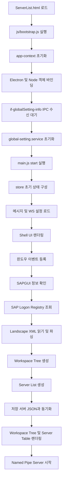

# ServerList_v2 함수 단위 분리 설계

## 1. 전제

본 설계는 기존 프로젝트 대표 폴더명을 `ServerList_v2`로 유지하고, 시작 HTML 파일명도 `ServerList.html`로 유지하는 것을 기준으로 한다.

전환 목적은 **Electron 환경은 유지하면서 SAPUI5만 제거**하는 것이다. 따라서 기존처럼 Node.js, Electron, 파일 시스템, Registry, PowerShell, Named Pipe Server 등의 로컬 기능은 계속 사용할 수 있다.

기존 `ServerList.js`가 담당하던 역할을 다음 기준으로 분리한다.

- **기존 `ServerList.js`의 동작 함수/경로/리소스는 최대한 유지**
- SAPUI5 Control 생성 부분만 HTML DOM 렌더링 계층으로 교체
- Electron/Node 의존 로직은 제거하지 않고 service 계층으로 감싸서 재사용
- `APPPATH`는 기존 소스 기준처럼 Electron 프로젝트의 `www` 루트 경로로 유지
- 사운드 파일은 신규 `assets/audio/message.wav`를 만들지 않고 기존 `APPPATH/sound/sap/sapmsg.wav`, `APPPATH/sound/sap/saperror.wav` 경로를 그대로 사용
- SAP Landscape XML 처리 로직 분리
- 저장 서버 JSON 처리 로직 분리
- 로그인 실행 흐름 분리
- 설정, 메시지, Busy/Dialog/Toast 컴포넌트 분리

---

## 2. 최종 폴더 구조 제안

```text
ServerList_v2/
├─ ServerList.html
├─ assets/
│  ├─ css/
│  │  ├─ base.css
│  │  ├─ layout.css
│  │  ├─ titlebar.css
│  │  ├─ workspace-tree.css
│  │  ├─ server-list.css
│  │  ├─ dialog.css
│  │  ├─ toast.css
│  │  └─ responsive.css
│  └─ images/
├─ js/
│  ├─ main.js
│  ├─ bootstrap.js
│  ├─ app-context.js
│  ├─ state/
│  │  ├─ store.js
│  │  └─ actions.js
│  ├─ services/
│  │  ├─ global-setting.service.js
│  │  ├─ sap-landscape.service.js
│  │  ├─ sap-logon-registry.service.js
│  │  ├─ sapgui.service.js
│  │  ├─ saved-server.service.js
│  │  ├─ login.service.js
│  │  ├─ ws-setting.service.js
│  │  ├─ message.service.js
│  │  └─ pipe-server.service.js
│  ├─ ui/
│  │  ├─ shell.ui.js
│  │  ├─ titlebar.ui.js
│  │  ├─ workspace-tree.ui.js
│  │  ├─ server-table.ui.js
│  │  ├─ server-edit-dialog.ui.js
│  │  ├─ server-settings-dialog.ui.js
│  │  ├─ app-settings-menu.ui.js
│  │  ├─ busy.ui.js
│  │  ├─ message-box.ui.js
│  │  └─ toast.ui.js
│  ├─ events/
│  │  ├─ window.events.js
│  │  ├─ workspace.events.js
│  │  ├─ server.events.js
│  │  └─ settings.events.js
│  └─ utils/
│     ├─ dom.js
│     ├─ event-bus.js
│     ├─ xml.js
│     ├─ sort.js
│     ├─ validator.js
│     └─ debounce.js
├─ modules/
│  └─ Server/
│     └─ net/
│        ├─ index.js
│        └─ PRC_MODULES/
└─ css/
   ├─ server.css
   └─ serverInfo.css
```

`css/` 기존 폴더는 초기 전환 중 호환용으로 유지한다. 기존 `serverInfo.css`에서 재사용 가능한 스타일은 최대한 유지하고, UI5 클래스에 의존하는 부분만 신규 CSS로 대체한다.

중요: 기존 프로젝트의 사운드 리소스는 `ServerList_v2/assets/audio`가 아니라 Electron `APPPATH` 기준 `sound/sap` 하위에 존재한다. 따라서 사운드 파일을 새로 만들거나 경로를 바꾸지 않는다.

---

## 3. ServerList.html 역할

`ServerList.html`은 파일명을 유지한다. UI5 bootstrap만 제거하고, 기존에 존재하는 `u4aWsAudio`, `u4aWsBusyIndicator`, `#content` 같은 진입 DOM은 최대한 유지한다.

즉, HTML을 완전히 새로 갈아엎기보다 기존 DOM ID를 유지해서 `ServerList.js`에 있던 보조 로직의 영향 범위를 줄인다.

```html
<!DOCTYPE html>
<html lang="ko">
<head>
  <title>U4A Workspace #ServerList</title>
  <meta charset="utf-8" />
  <meta name="viewport" content="width=device-width, initial-scale=1.0, maximum-scale=1.0, user-scalable=no" />
  <meta http-equiv="Content-Type" content="text/html;charset=utf-8" />
  <meta http-equiv="X-UA-Compatible" content="IE=Edge" />

  <!-- 기존 CSS 유지 -->
  <link rel="stylesheet" href="./css/serverInfo.css" />

  <!-- 신규 HTML 전환 CSS -->
  <link rel="stylesheet" href="./assets/css/base.css" />
  <link rel="stylesheet" href="./assets/css/layout.css" />
  <link rel="stylesheet" href="./assets/css/titlebar.css" />
  <link rel="stylesheet" href="./assets/css/workspace-tree.css" />
  <link rel="stylesheet" href="./assets/css/server-list.css" />
  <link rel="stylesheet" href="./assets/css/dialog.css" />
  <link rel="stylesheet" href="./assets/css/toast.css" />
  <link rel="stylesheet" href="./assets/css/responsive.css" />
</head>
<body>
  <!-- 기존 사운드 DOM ID 유지: ServerList.js의 setSoundMsg 영향 최소화 -->
  <audio id="u4aWsAudio" style="visibility:hidden;"></audio>

  <!-- 기존 Busy DOM ID 유지: 초기 로딩 구간 호환 -->
  <div id="u4aWsBusyIndicator" class="u4aWsBusyIndicator" style="position:absolute;display:block;top:0;height:100%;width:100%;left:0;">
    <div class="u4aWsBusyDotWrap">
      <div></div>
      <div></div>
      <div></div>
    </div>
  </div>

  <!-- 기존 content ID 유지 -->
  <div id="content" class="app-root"></div>

  <div id="dialog-root"></div>
  <div id="toast-root"></div>

  <script src="./js/app-context.js"></script>
  <script src="./js/bootstrap.js"></script>
</body>
</html>
```

---

## 4. 전체 실행 흐름



---

## 5. app-context.js

Electron/Node 공통 객체를 한 곳에서 관리한다.

### 담당 역할

- `require` 기반 Node 모듈 로딩
- `@electron/remote` 참조
- `ipcRenderer` 참조
- 현재 BrowserWindow 참조
- 앱 경로, 설정 경로, 공통 모듈 경로 보관

### 예시 구조

```js
(function () {
  const REMOTE = require("@electron/remote");
  const PATH = require("path");
  const FS = require("fs");
  const IPCRENDERER = require("electron").ipcRenderer;

  window.oAPP = window.oAPP || {};

  window.oAPP.ctx = {
    REMOTE,
    PATH,
    FS,
    IPCRENDERER,
    APP: REMOTE.app,
    CURRWIN: REMOTE.getCurrentWindow(),
    DIALOG: REMOTE.dialog,
    // 기존 ServerList.js 기준 APPPATH 유지
    // Cordova/Electron 패키징 구조상 이 값은 www 루트 기준으로 사용된다.
    APPPATH: REMOTE.app.getAppPath(),
    USERDATA: REMOTE.app.getPath("userData")
  };
})();
```

---

## 5.1 기존 리소스 경로 유지 원칙

이번 전환은 UI5 제거가 목적이므로 기존 Electron 프로젝트의 리소스 경로는 임의로 바꾸지 않는다.

특히 기존 `ServerList.js`의 사운드 로직은 아래 기준으로 유지한다.

```js
const sSoundRootPath = PATH.join(APPPATH, "sound", "sap");

if (TYPE === "01") {
  sAudioPath = PATH.join(sSoundRootPath, "sapmsg.wav");
}

if (TYPE === "02") {
  sAudioPath = PATH.join(sSoundRootPath, "saperror.wav");
}
```

따라서 신규 설계에서는 다음을 하지 않는다.

- `assets/audio/message.wav` 신규 정의 안 함
- 기존 `sound/sap/sapmsg.wav` 경로 변경 안 함
- 기존 `sound/sap/saperror.wav` 경로 변경 안 함
- `u4aWsAudio` DOM ID 변경 안 함

사운드 설정 UI만 HTML 기반으로 바꾸고, 실제 재생 함수는 기존 `oAPP.setSoundMsg(TYPE)` 흐름을 그대로 재사용하는 방향이 안전하다.
---

## 6. bootstrap.js

기존 `fnLoadBootStrapSetting()`의 대체 진입점이다. UI5 bootstrap을 하지 않고 Electron 초기 설정 수신 후 `main.start()`를 호출한다.

### 담당 역할

- `app-context.js` 로드 이후 실행
- `if-globalSetting-info` IPC 수신
- 글로벌 설정 저장
- `main.js` 시작 호출

### 주요 함수

| 함수 | 역할 |
|---|---|
| `waitGlobalSetting()` | `if-globalSetting-info` IPC 수신 대기 |
| `loadScripts()` | 필요한 JS 모듈 로드 |
| `bootstrap()` | 전체 앱 진입 |

---

## 7. main.js

기존 `_onLoad()`와 `fnOnMainStart()`의 역할을 대체한다.

### 담당 역할

- 전체 앱 시작 순서 제어
- Busy ON/OFF
- 메시지, 설정, 모델 초기화
- 화면 렌더링
- SAP Logon 목록 로드
- Named Pipe Server 시작

### 주요 함수

| 함수 | 기존 대응 함수 | 역할 |
|---|---|---|
| `start()` | `_onLoad`, `fnOnMainStart` | 앱 전체 시작 |
| `initializeApp()` | `fnOnMainStart` 일부 | 메시지/설정/상태 초기화 |
| `renderAppShell()` | `fnOnInitRendering` | 기본 화면 구조 생성 |
| `loadSapLogonData()` | `fnOnListupSapLogon` | SAP Logon 데이터 로드 |
| `startPipeServer()` | `oU4ASERV.createServer` | Named Pipe Server 시작 |

---

## 8. state/store.js

UI5 JSONModel을 대체하는 전역 상태 저장소다.

### 상태 구조

```js
const state = {
  globalSettings: {},
  language: {},
  wsSettings: {},
  sapGuiInfo: {},
  sapLogon: {},
  landscapeFilePath: "",
  workspaceTree: [],
  serverList: [],
  selectedWorkspaceNode: null,
  selectedWorkspaceItems: [],
  savedServers: [],
  selectedServer: null,
  lastSelectedNodeKey: "",
  busy: false
};
```

### 주요 함수

| 함수 | 역할 |
|---|---|
| `getState()` | 현재 상태 반환 |
| `setState(partialState)` | 상태 병합 후 구독자 알림 |
| `subscribe(listener)` | 상태 변경 감지 등록 |
| `resetSapLogonState()` | SAP Logon 관련 상태 초기화 |

---

## 9. state/actions.js

화면 이벤트에서 바로 service를 호출하지 않도록 중간 액션 계층을 둔다.

### 주요 함수

| 함수 | 역할 |
|---|---|
| `selectWorkspaceNode(nodeId)` | Tree 선택 처리 |
| `selectServer(serverUuid)` | 서버 선택 처리 |
| `openServer(serverUuid)` | 서버 더블클릭 처리 |
| `saveServerConnection(payload)` | 서버 접속 정보 저장 |
| `deleteSavedServer(serverUuid)` | 저장 서버 삭제 |
| `saveServerSettings(serverUuid, settings)` | 서버별 설정 저장 |
| `reloadSapLogon()` | SAP Landscape 재로딩 |

---

## 10. services/sap-logon-registry.service.js

SAP Logon 관련 Registry 조회를 담당한다.

### 기존 대응 함수

- `fnGetRegInfoForSAPLogon`
- `fnGetRegInfoForSAPLogonThen`
- `fnSetRegInfo`
- `fnGetRegInfo`

### 주요 함수

| 함수 | 역할 |
|---|---|
| `getSapLogonRegistryInfo()` | SAP Logon Registry 정보 조회 |
| `getLandscapeFilePath()` | LandscapeFile 경로 반환 |
| `saveLastSelectedNodeKey(uuid)` | 마지막 선택 Workspace UUID 저장 |
| `getLastSelectedNodeKey()` | 마지막 선택 Workspace UUID 조회 |
| `saveSelectedSystemInfo(info)` | 선택 시스템 정보 Registry 저장 |

---

## 11. services/sap-landscape.service.js

SAP Landscape XML 파일 읽기, 파싱, 서버 목록 변환, Workspace Tree 생성을 담당한다.

### 기존 대응 함수

- `fnReadSAPLogonData`
- `fnReadSAPLogonDataThen`
- `fnSetSAPLogonLandscapeList`
- `fnCreateWorkspaceTree`
- `fnWorkSpaceSort`
- `_getRouterInfo`
- `_getMsgServerInfo`

### 주요 함수

| 함수 | 역할 |
|---|---|
| `readLandscapeXml(filePath)` | XML 파일 읽기 |
| `parseLandscapeXml(xmlText)` | XML 문자열을 JS 객체로 변환 |
| `normalizeServices(landscape)` | `Services.Service` 배열 정규화 |
| `createServerList(landscape, msgServPorts)` | 전체 서버 목록 생성 |
| `createWorkspaceTree(landscape)` | Workspace Tree 생성 |
| `findServersByWorkspaceNode(nodeUuid)` | 선택 Workspace 기준 서버 목록 추출 |
| `findWorkspaceRootByServerUuid(serverUuid)` | 서버가 속한 Workspace Root 찾기 |
| `watchLandscapeFile(filePath, callback)` | SAP Landscape XML 변경 감지 |

---

## 12. services/saved-server.service.js

로컬 저장 서버 JSON 파일을 관리한다.

### 기존 대응 함수

- `fnGetSavedServerListData`
- `fnGetSavedServerListDataAll`
- `fnPressSave`
- `fnPressDelete`
- `_syncSavedServerInfo`
- `_saveServerSettings`

### 주요 함수

| 함수 | 역할 |
|---|---|
| `readSavedServers()` | 저장 서버 목록 전체 읽기 |
| `findSavedServer(uuid)` | UUID 기준 저장 서버 조회 |
| `saveServer(serverInfo)` | 서버 접속 정보 저장/수정 |
| `deleteServer(uuid)` | 저장 서버 삭제 |
| `updateServerSettings(uuid, settings)` | 서버별 설정 저장 |
| `syncSavedState(serverItems, savedServers)` | Active/Inactive 상태 동기화 |

---

## 13. services/sapgui.service.js

SAPGUI 설치 여부, 버전, 설치 경로 확인을 담당한다.

### 기존 대응 함수

- `fnCheckSapguiVersion`
- PowerShell `get_sapgui_inf.ps1` 실행 관련 로직

### 주요 함수

| 함수 | 역할 |
|---|---|
| `checkSapGuiVersion()` | PowerShell 실행 후 SAPGUI 정보 반환 |
| `getSapGuiScriptPath()` | SAPGUI 체크용 PS 파일 경로 반환 |
| `validateSapGuiInfo(result)` | SAPGUI 버전/bit 정보 검증 |
| `saveSapGuiInfoToRegistry(info)` | SAPGUI 정보를 Registry에 저장 |

---

## 14. services/login.service.js

서버 더블클릭 후 실제 로그인 페이지 실행 정보를 구성한다.

### 기존 대응 함수

- `fnPressServerListItem`
- `fnLoginPage`
- `OPEN_SERVER` 모듈 내부 로그인 구성 일부

### 주요 함수

| 함수 | 역할 |
|---|---|
| `createLoginInfo(server, savedServer, options)` | 로그인 정보 객체 생성 |
| `saveSelectedSystem(loginInfo)` | 선택 시스템 Registry 저장 |
| `openLoginPage(loginInfo)` | 로그인 화면 실행 |
| `openServerBySysId(params)` | 외부 요청 기준 서버 자동 실행 |

---

## 15. services/ws-setting.service.js

Workspace 언어, 테마, 사운드 설정을 관리한다.

### 기존 대응 함수

- `_openWsLanguSettingPopup`
- `_saveWsLangu`
- `_openWSThemeSettingPopup`
- `_saveWsThemeInfo`
- `_openWsSoundSettingPopup`

### 주요 함수

| 함수 | 역할 |
|---|---|
| `readWsSettings()` | WS 설정 JSON 읽기 |
| `saveLanguage(languageKey)` | 언어 설정 저장 |
| `saveTheme(themeKey)` | 테마 설정 저장 |
| `saveSound(soundOptions)` | 사운드 설정 저장 |
| `applyTheme(themeKey)` | HTML body/data-theme 반영 |

---

## 16. services/message.service.js

기존 UI5 Core Model `/WSLANGU`를 대체한다.

### 기존 대응 함수

- `fnWsGlobalMsgList`
- `fnOnInitModeling`

### 주요 함수

| 함수 | 역할 |
|---|---|
| `loadMessages(languageKey)` | 언어별 메시지 JSON 로드 |
| `getMessage(path, fallback)` | 메시지 텍스트 반환 |
| `formatMessage(path, values)` | 치환값 포함 메시지 반환 |

---

## 17. services/pipe-server.service.js

기존 `modules/Server/net/index.js`를 감싸는 서비스 계층이다. 기존 모듈 구조는 최대한 유지한다.

### 기존 대응 함수

- `oU4ASERV.createServer`
- `PRC_MODULES/[PRCCD]/index.js`

### 주요 함수

| 함수 | 역할 |
|---|---|
| `startPipeServer()` | Named Pipe Server 생성 |
| `stopPipeServer()` | Pipe Server 종료 |
| `handlePipeRequest(payload)` | PRCCD 기준 요청 분기 |
| `openServerFromPipe(payload)` | OPEN_SERVER 요청 처리 |

---

## 18. UI 모듈 분리

### 18.1 ui/shell.ui.js

전체 DOM Shell을 생성한다.

| 함수 | 역할 |
|---|---|
| `renderShell(root)` | 기본 레이아웃 생성 |
| `getShellRefs()` | 주요 DOM 참조 반환 |
| `clearShell()` | Shell 초기화 |

### 18.2 ui/titlebar.ui.js

상단 타이틀바를 관리한다.

| 함수 | 역할 |
|---|---|
| `renderTitlebar(container)` | 타이틀바 렌더링 |
| `bindTitlebarEvents()` | 최소화/최대화/닫기 이벤트 바인딩 |
| `setWindowFocusState(isFocused)` | 창 focus/blur 스타일 반영 |

### 18.3 ui/workspace-tree.ui.js

좌측 Workspace Tree를 렌더링한다.

| 함수 | 역할 |
|---|---|
| `renderWorkspaceTree(container, treeData)` | Tree DOM 생성 |
| `renderTreeNode(node, depth)` | 단일 Tree Node 생성 |
| `setSelectedNode(uuid)` | 선택 상태 표시 |
| `expandNode(uuid)` | 노드 펼침 |
| `collapseNode(uuid)` | 노드 접기 |

### 18.4 ui/server-table.ui.js

우측 서버 목록을 렌더링한다.

| 함수 | 역할 |
|---|---|
| `renderServerTable(container, serverItems)` | 서버 테이블 렌더링 |
| `renderServerRow(server)` | 서버 Row 생성 |
| `setSelectedServer(uuid)` | 선택 Row 표시 |
| `updateServerStatus(uuid, isSaved)` | Active/Inactive 상태 갱신 |

### 18.5 ui/server-edit-dialog.ui.js

서버 등록/수정 팝업을 담당한다.

| 함수 | 역할 |
|---|---|
| `openServerEditDialog(server, savedData)` | 등록/수정 팝업 열기 |
| `closeServerEditDialog()` | 팝업 닫기 |
| `getServerEditFormData()` | 입력값 수집 |
| `showValidationError(message)` | 입력 오류 표시 |

### 18.6 ui/server-settings-dialog.ui.js

서버별 Settings 팝업을 담당한다.

| 함수 | 역할 |
|---|---|
| `openServerSettingsDialog(server)` | Settings 팝업 열기 |
| `getServerSettingsFormData()` | 설정값 수집 |
| `closeServerSettingsDialog()` | 팝업 닫기 |

### 18.7 ui/app-settings-menu.ui.js

우측 상단 언어/테마/사운드/About 메뉴를 담당한다.

| 함수 | 역할 |
|---|---|
| `renderSettingsMenu(container)` | 설정 메뉴 렌더링 |
| `openLanguagePopup()` | 언어 설정 팝업 |
| `openThemePopup()` | 테마 설정 팝업 |
| `openSoundPopup()` | 사운드 설정 팝업 |
| `openAboutPopup()` | About 팝업 |

---

## 19. 공통 UI 컴포넌트

### busy.ui.js

| 함수 | 역할 |
|---|---|
| `showBusy(message)` | Busy 표시 |
| `hideBusy()` | Busy 숨김 |
| `setBusyText(message)` | Busy 메시지 변경 |

### message-box.ui.js

| 함수 | 역할 |
|---|---|
| `alert(message, options)` | 알림 |
| `confirm(message, options)` | 확인/취소 |
| `error(message, options)` | 오류 |
| `warning(message, options)` | 경고 |

### toast.ui.js

| 함수 | 역할 |
|---|---|
| `showToast(message, options)` | Toast 표시 |
| `clearToast()` | Toast 제거 |

---

## 20. 이벤트 모듈 분리

### events/window.events.js

| 함수 | 역할 |
|---|---|
| `attachCurrentWindowEvents()` | 현재 BrowserWindow 이벤트 등록 |
| `onWindowFocus()` | focus 스타일 처리 |
| `onWindowBlur()` | blur 스타일 처리 |
| `onBeforeClose()` | 종료 전 처리 |

### events/workspace.events.js

| 함수 | 역할 |
|---|---|
| `bindWorkspaceTreeEvents()` | Tree 이벤트 바인딩 |
| `onWorkspaceNodeClick(event)` | Workspace 선택 |
| `onWorkspaceNodeToggle(event)` | Tree expand/collapse |

### events/server.events.js

| 함수 | 역할 |
|---|---|
| `bindServerTableEvents()` | Server Table 이벤트 바인딩 |
| `onServerRowClick(event)` | Row 선택 |
| `onServerRowDoubleClick(event)` | 로그인/등록 팝업 분기 |
| `onServerEditClick(event)` | Edit 팝업 오픈 |
| `onServerDeleteClick(event)` | 삭제 처리 |
| `onServerSettingsClick(event)` | Settings 팝업 오픈 |

### events/settings.events.js

| 함수 | 역할 |
|---|---|
| `bindSettingsMenuEvents()` | 설정 메뉴 이벤트 바인딩 |
| `onLanguageSave(event)` | 언어 저장 |
| `onThemeSave(event)` | 테마 저장 |
| `onSoundSave(event)` | 사운드 저장 |

---

## 21. utils 모듈

| 파일 | 역할 |
|---|---|
| `dom.js` | DOM 생성, class 제어, event delegation 유틸 |
| `event-bus.js` | 모듈 간 이벤트 발행/구독 |
| `xml.js` | XML 파싱 유틸 |
| `sort.js` | Workspace/Server 정렬 유틸 |
| `validator.js` | protocol/host/port 입력 검증 |
| `debounce.js` | 파일 변경 감지 debounce |

---

## 22. 기존 함수 매핑표

| 기존 함수 | 신규 위치 | 신규 함수명 |
|---|---|---|
| `fnLoadBootStrapSetting` | `bootstrap.js` | `bootstrap` |
| `_onLoad` | `main.js` | `start` |
| `fnOnMainStart` | `main.js` | `initializeApp` |
| `fnOnInitModeling` | `state/store.js`, `message.service.js` | `setState`, `loadMessages` |
| `fnOnInitRendering` | `ui/shell.ui.js` | `renderShell` |
| `fnGetWorkSpaceTreeTable` | `ui/workspace-tree.ui.js` | `renderWorkspaceTree` |
| `fnGetSAPLogonListTable` | `ui/server-table.ui.js` | `renderServerTable` |
| `fnPressWorkSpaceTreeItem` | `actions.js` | `selectWorkspaceNode` |
| `fnPressServerListItem` | `actions.js`, `login.service.js` | `openServer` |
| `fnOnListupSapLogon` | `main.js`, `sap-landscape.service.js` | `loadSapLogonData` |
| `fnGetRegInfoForSAPLogon` | `sap-logon-registry.service.js` | `getSapLogonRegistryInfo` |
| `fnReadSAPLogonData` | `sap-landscape.service.js` | `readLandscapeXml` |
| `fnSetSAPLogonLandscapeList` | `sap-landscape.service.js` | `createServerList` |
| `fnCreateWorkspaceTree` | `sap-landscape.service.js` | `createWorkspaceTree` |
| `fnCheckSapguiVersion` | `sapgui.service.js` | `checkSapGuiVersion` |
| `fnPressSave` | `saved-server.service.js` | `saveServer` |
| `fnPressDelete` | `saved-server.service.js` | `deleteServer` |
| `_syncSavedServerInfo` | `saved-server.service.js` | `syncSavedState` |
| `_saveServerSettings` | `saved-server.service.js` | `updateServerSettings` |
| `ev_settingItemSelected` | `settings.events.js` | `onSettingsMenuSelected` |
| `_saveWsLangu` | `ws-setting.service.js` | `saveLanguage` |
| `_saveWsThemeInfo` | `ws-setting.service.js` | `saveTheme` |
| `fnWsGlobalMsgList` | `message.service.js` | `loadMessages` |
| `fnSapLogonFileChange` | `sap-landscape.service.js` | `watchLandscapeFile` |

---

## 23. 전환 작업 순서

### 1단계: UI5 제거 전 데이터 로직 선분리

- `sap-landscape.service.js`
- `saved-server.service.js`
- `sap-logon-registry.service.js`
- `sapgui.service.js`
- `message.service.js`

먼저 기존 SAPUI5 화면은 유지한 상태에서 데이터 처리 함수만 분리한다.

### 2단계: 상태 저장소 도입

- UI5 JSONModel 대신 `store.js` 생성
- 기존 `/ServerList`, `/SAPLogon`, `/SAPLogonItems`, `/WSLANGU` 데이터를 state로 이관
- 기존 화면과 신규 화면이 같은 state를 바라보도록 중간 브릿지 구성

### 3단계: HTML Shell 구현

- `ServerList.html`에서 UI5 bootstrap 제거
- `renderShell()`로 화면 골격 생성
- Titlebar, Workspace Tree, Server Table 순서로 구현

### 4단계: 이벤트 연결

- Tree 선택
- 서버 Row 선택/더블클릭
- 저장/삭제/설정 팝업
- 언어/테마/사운드 설정

### 5단계: Electron 기능 재연결

- 현재 창 minimize/maximize/close
- Registry read/write
- SAPGUI PowerShell 체크
- 파일 감시
- Named Pipe Server
- 로그인 페이지 실행

### 6단계: 기존 UI5 코드 제거

- `sap.m.*`, `sap.ui.*` 의존 제거
- UI5 bootstrap 제거
- UI5 theme/model/message 의존 제거

---

## 24. 핵심 설계 기준

이번 전환은 브라우저 독립형 웹앱이 아니라 **Electron Renderer에서 동작하는 HTML5 UI 전환**이다.

따라서 다음 로직은 유지 가능하다.

- `require("fs")`
- `require("path")`
- `@electron/remote`
- `ipcRenderer`
- Registry 접근
- PowerShell 실행
- Named Pipe Server
- 로컬 JSON 파일 저장
- SAP Landscape XML 파일 감시

반대로 제거 대상은 다음이다.

- SAPUI5 bootstrap
- `sap.m.*` Control 생성
- `sap.ui.table.TreeTable`
- `sap.m.Table`
- UI5 JSONModel
- UI5 MessageBox
- UI5 BusyIndicator
- UI5 Theme 적용 방식

---

## 25. 최종 요약

`ServerList_v2`는 폴더명과 `ServerList.html` 진입 파일명을 유지하고, 내부 구현만 SAPUI5 기반에서 HTML5 DOM 기반으로 전환한다.

핵심 방향은 다음과 같다.

```text
기존 구조:
ServerList.html
→ ServerList.js
→ UI5 Bootstrap
→ SAPUI5 Control 동적 생성
→ UI5 JSONModel 바인딩

신규 구조:
ServerList.html
→ js/bootstrap.js
→ js/main.js
→ Electron/Node Service 초기화
→ Store 상태 구성
→ HTML DOM 렌더링
→ 이벤트 기반 상태 갱신
```

Electron 기능은 유지하므로 SAPGUI 감지, Registry, 파일 저장, Named Pipe, `APPPATH` 기준 리소스 경로, `sound/sap` 사운드 파일 경로는 기존 구조를 재사용하거나 service 계층으로 감싸서 이전하면 된다. 실제 제거 대상은 UI5 렌더링 계층이며, 데이터 처리와 Electron 연동 로직은 분리 후 재활용하는 방향이 가장 안전하다.
